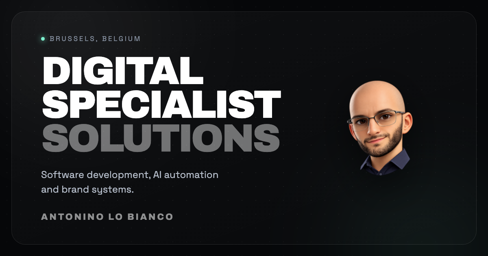

# Portfolio 2026 — Antonino Lo Bianco

> Digital Specialist Solutions — développement web et logiciel, automatisation par l'IA, identité visuelle. Bruxelles.

Portfolio personnel bilingue, construit en Next.js. Quatre sections qui
défilent, une démonstration d'automatisation que le visiteur manipule
lui-même, et un formulaire de contact qui arrive vraiment dans ma boîte.



**Stack :** Next.js 16 (App Router, Turbopack) · React 19 · TypeScript · CSS Modules

---

## Démarrer

```bash
npm install
cp .env.example .env.local   # puis renseigner les clés, voir plus bas
npm run dev                  # http://localhost:3000
```

| Commande | Rôle |
| --- | --- |
| `npm run dev` | serveur de développement |
| `npm run build` | build de production |
| `npm start` | sert le build |
| `npx eslint .` | lint |
| `npx tsc --noEmit` | vérification des types |

---

## Variables d'environnement

Les vraies valeurs vivent dans `.env.local`, **qui n'est jamais versionné**.
`.env.example` est un gabarit : il ne contient que les noms.

| Variable | Rôle | Secret ? |
| --- | --- | --- |
| `NEXT_PUBLIC_WEB3FORMS_KEY` | formulaire de contact | Non, publique par conception |
| `GEMINI_API_KEY` | démonstration de tri | **Oui**, jamais côté navigateur |

La clé Web3Forms porte le préfixe `NEXT_PUBLIC_` parce que le service
attend un envoi depuis le navigateur et refuse les appels serveur. Elle ne
permet rien d'autre que d'écrire dans ma boîte mail.

La clé Gemini, elle, ne quitte jamais le serveur.

> **Au déploiement**, il faut reporter ces deux variables dans les
> réglages de l'hébergeur. `.env.local` reste sur la machine de
> développement et n'est pas envoyé.

---

## Ce que contient le site

**Accueil** — titre frappé en continu, trois domaines d'intervention, fond
animé discret.

**Projets** — mosaïque irrégulière de quatre réalisations, dont deux sites
clients en production.

**À propos** — parcours, et une constellation interactive des outils que
j'utilise, reliés entre eux.

**Contact** — formulaire relié à Web3Forms, coordonnées directes.

**`/triage`** — démonstration d'automatisation. Le visiteur écrit un
message, il est classé, une réponse est rédigée et l'action à mener est
décidée. Rien n'est conservé.

Le site est **bilingue français et anglais**. La langue du visiteur est
détectée à la première visite, son choix est ensuite mémorisé.

---

## Quelques choix techniques

**Mise à l'échelle proportionnelle.** Les sections ne sont pas figées en
pixels : elles se dimensionnent en proportion de la fenêtre, à partir
d'une unité de base commune. La page garde donc exactement les mêmes
rapports de 1280 à 2560 pixels de large.

**Deux défilements différents.** Sur grand écran, la molette fait changer
de section d'un geste, avec un verrou qui empêche d'en sauter plusieurs :
l'inertie d'un pavé tactile ne compte que pour un geste. Sur téléphone,
aucune aimantation, le doigt commande.

**Le tri fonctionne toujours.** Le moteur de `/triage` est de la logique
pure, sans appel réseau, donc réutilisable et testable. Quand le modèle
n'est pas joignable, un classement déterministe par règles prend le
relais : la démonstration répond même sans clé configurée.

**Aucune dépendance externe au chargement.** Les icônes, les polices et
les visuels sont servis par le site lui-même. Aucune requête vers un
service tiers.

---

## Structure

```
src/
├── app/
│   ├── api/triage/     # tri d'un message, clé côté serveur
│   ├── triage/         # la page de démonstration
│   ├── globals.css     # couleurs, animations, unités
│   └── layout.tsx      # polices et métadonnées
├── components/
│   ├── Portfolio.tsx   # défilement, section active, mobilier fixe
│   └── panels/         # une section par fichier, avec son CSS
├── hooks/              # langue, media queries, effets, machine à écrire
└── lib/
    ├── content.ts      # projets, liens, visuels
    ├── i18n.ts         # tous les textes, les deux langues côte à côte
    └── triage.ts       # moteur de tri, logique pure
```

**Pour modifier un texte**, un seul fichier : `src/lib/i18n.ts`. Les deux
langues y sont côte à côte, impossible d'en oublier une.

**Pour ajouter un projet**, un objet dans `src/lib/content.ts` et son
texte dans `i18n.ts`. Les champs `cols` et `rows` décident de sa place
dans la mosaïque.

---

## Déploiement

1. Reporter `NEXT_PUBLIC_WEB3FORMS_KEY` et `GEMINI_API_KEY` chez
   l'hébergeur.
2. Déployer depuis la branche `main`.
3. Lier le nom de domaine.
4. Envoyer un message depuis le formulaire pour vérifier qu'il arrive.
5. Passer l'URL dans le *Post Inspector* de LinkedIn : leur cache
   d'aperçus est tenace, sans ça le premier partage peut rester sans
   vignette.

---

## Crédits

Design et développement : Antonino Lo Bianco.
Icônes des outils : [Simple Icons](https://simpleicons.org), servies en local.
